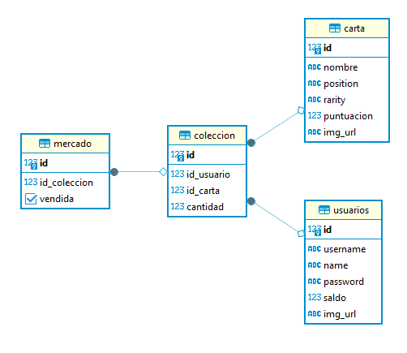

*Este tutorial asume que tienes los contenedores ya en pie!*

Vamos a seguir los siguientes pasos para poner en funcionamiento nuestra base de datos:

1. Instalar Dbeaver
2. Comprobar estado de los contenedores
3. Conectar a la base de datos
4. Ejecutar script

## Instalar Dbeaver
*Si ya tienes Dbeaver instalado, puedes saltarte este paso*  
  
En este proyecto trabajamos con DBeaver  
WIP  

## Comprobar estado de los contenedores
*Seguramente estas buscando `docker ps` si no es tu primera vez en esta página*

WIP  

## Conectar a la base de datos
*Seguramente estas buscando saber que el puerto es **5433** si no es tu primera vez en esta página*

WIP

## Ejecutar script
*Seguramente estas buscando este [**enlace al script**]() si no es tu primera vez en esta página*

WIP